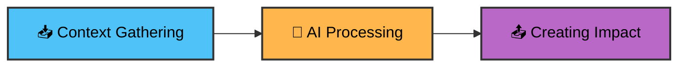

## Step 2: Composing AI Workflows

Great work! Your first AI workflow is now functional. Next, let's see how to combine the `ai-inference` action with other actions to create meaningful AI workflows for your projects.

### 📖 Theory: Composing AI Workflows

AI adds the most value in Actions when you connect three sequential processes to create intelligent automation:



Here's how this workflow pattern works:

1. **📥 Context Gathering**: Use GitHub Actions to collect data from [event context](https://docs.github.com/en/actions/learn-github-actions/contexts#github-context), file contents, API results, or outputs from previous workflow steps
1. **🤖 AI Processing**: Feed the gathered context into `actions/ai-inference` with a focused [system prompt](https://github.com/actions/ai-inference#system-prompts) that defines the AI's role and expected output format.
1. **📤 Creating Impact**: Use the AI's response as input to another action that creates meaningful change—posting comments, updating files, or triggering other workflows

This three-step pattern keeps workflows maintainable while automating judgment-heavy tasks that would be difficult to script with traditional logic.

### ⌨️ Activity: Create an issue analyzer workflow

In this activity, we'll build a complete AI workflow that demonstrates the three-step pattern: gathering context from newly opened GitHub issue events, processing that context with AI to generate analysis, and creating impact by posting the results as an issue comment.

1. Create a new workflow file named:

    ```text
    issue-analyzer.yml
    ```

1. Add the workflow metadata and permissions

   ```yaml
   name: Issue Analyzer

   on:
     issues:
       types: [opened]

   permissions:
     models: read
     issues: write
   ```

   This workflow will run whenever a new issue is opened with the permissions to access GitHub Models and to write new issue comments.

   > ❗ **Caution:** Copy the contents as provided, as this exact workflow name (`Issue Analyzer`) is required to progress to next steps of this exercise.

1. Now we'll create a job that uses the AI inference action.

   In this scenario we want to analyze the issue content to provide intelligent feedback and recommendations:

   GitHub Actions automatically provides us with rich context through the `github.event` object whenever an issue is opened. This includes the issue title, body content, and author information—exactly the data our AI needs to provide intelligent analysis.

   ```yaml
   jobs:
     analyze:
       name: AI Issue Analyzer
       runs-on: ubuntu-latest
       steps:
         - name: Analyze issue with AI
           id: ai-response
           uses: actions/ai-inference@v2
           with:
             token: ${{ secrets.GITHUB_TOKEN }}
             max-tokens: 1000
             system-prompt: |
               You are a GitHub issue assistant. Your task is to analyze newly opened issues.

               Provide concise, helpful suggestions, ask clarifying questions and identify any missing information that would help resolve the issue faster.

               Always respond with ready-to-use markdown content (no code blocks) that can be posted directly as an issue comment.

               Sign off as AI assistant.
             prompt: |
               New issue was opened by ${{ github.event.issue.user.login }}
               Title: ${{ github.event.issue.title }}
               Body:
               ---
               ${{ github.event.issue.body }}
               ---
   ```

   > 🪧 **Note:** The **`max-tokens`** parameter is used to control the maximum length of the response. Low values could mean the response is cut off halway.

1. Now we'll use the `ai-inference` `response` output to post a comment back to the issue to provide immediate feedback:

   ```yaml
   - name: Comment results on the issue
     uses: peter-evans/create-or-update-comment@v4
     with:
       token: ${{ secrets.GITHUB_TOKEN }}
       issue-number: ${{ github.event.issue.number }}
       body: ${{ steps.ai-response.outputs.response }}

   ```

1. And we're done! Commit the file directly to the `main` branch, then open the **Actions** tab and confirm the workflow appears.

<details>
<summary>Having trouble? 🤷</summary><br/>

- If the action does not appear in the **Actions** tab verify you put it in `.github/workflows/` directory with `.yml` extension

</details>

### ⌨️ Activity: Test the workflow

1. Navigate to the Issues tab and click **New issue**.
1. Create an issue with any title and body you'd like, or use these examples:

   **Title example:**

   ```text
   Login form throwing 500 errors on mobile
   ```

   **Body example:**

   ```markdown
   Getting 500 errors when trying to log in on my phone. It works sometimes but not always.
   ```

1. As you create the issue, you observe your workflow running in the **Actions** tab.
1. When the workflow completes, you should see a new comment on the issue with the AI Issue analysis.

<details>
<summary>Having trouble? 🤷</summary><br/>

- If the workflow didn’t run, confirm the trigger is `issues: [opened]` and you created a new issue (not edited an existing one).
- If the workflow failed to parse, check that the YAML indentation is correct and that all required fields are present.

</details>
