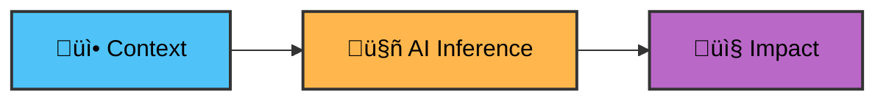

## Step 2: Composing AI Workflows

Great work! Your first AI workflow is now functional. Next, let's see how to combine the `ai-inference` action with other actions to create meaningful AI workflows for your projects.

### 📖 Theory: Composing AI Workflows

AI adds the most value in Actions when you connect three pieces:



- 📥 **Context**: Gather data from outputs of other actions (e.g file contents, API results, or computed values) or `github` [event context](https://docs.github.com/actions/reference/workflows-and-actions/contexts#github-context)
- 🤖 **Inference**: Use the context to build a focused prompt for `actions/ai-inference` to analyze
- 📤 **Impact**: Pass the AI result to another action/script to create impact.

This pattern keeps workflows simple while handling judgment‑heavy tasks that are hard to script deterministically.

> [!TIP]
>
> Want to dive deeper? Check out these resources:
>
> - 📖 [GitHub Actions Context](https://docs.github.com/en/actions/learn-github-actions/contexts)
> - 🔧 [Workflow Inputs](https://docs.github.com/en/actions/using-workflows/workflow-syntax-for-github-actions#onworkflow_dispatchinputs)
> - 🤖 [AI Inference System Prompts](https://github.com/actions/ai-inference#system-prompts)

### ⌨️ Activity: Create an issue analyzer workflow

1. Create `.github/workflows/issue-analyzer.yml` workflow on the `main` branch.

   Add the workflow metadata and permissions

   ```yaml
   name: Issue Analyzer

   on:
     issues:
       types: [opened]

   permissions:
     models: read
     issues: write
   ```

   This workflow will run whenever a new issue is opened with the permissions to access GitHub Models and to write new issue comments.

   > ❗ **Caution:** Copy the contents as provided, as this exact workflow name (`Issue Analyzer`) is required to progress to next steps of this exercise.

1. Now we'll create a job that uses the AI inference action.

   In this scenario we want to analyze the issue content to provide intelligent feedback and recommendations:

   ```yaml
   jobs:
     analyze:
       name: AI Issue Analyzer
       runs-on: ubuntu-latest
       steps:
         - name: Analyze issue with AI
           id: ai-response
           uses: actions/ai-inference@v2
           with:
             token: ${{ secrets.GITHUB_TOKEN }}
             system-prompt: |
               You are an assistant that triages GitHub issues. Summarize the issue, identify missing information and propose next steps. Be concise and actionable.
             prompt: |
               New issue was opened by ${{ github.event.issue.user.login }}
               Title: ${{ github.event.issue.title }}
               Body:
               ---
               ${{ github.event.issue.body }}
               ---
   ```

   > 🪧 **Note:** Notice how we are passing dynamic values from the `github` event context

1. Now we'll use the AI output file to post a comment back to the issue to provide immediate feedback:

   ```yaml
   - name: Comment results on the issue
     uses: peter-evans/create-or-update-comment@v4
     with:
       token: ${{ secrets.GITHUB_TOKEN }}
       issue-number: ${{ github.event.issue.number }}
       body-path: ${{ steps.ai-response.outputs.response-file }}
   ```

1. And we're done! Commit the file directly to the `main` branch, then open the **Actions** tab and confirm the workflow appears.

<details>
<summary>Having trouble? 🤷</summary><br/>

- If the action does not appear in the **Actions** tab verify you put it in `.github/workflows/` directory with `.yml` extension

</details>

### ⌨️ Activity: Test the workflow

1. Navigate to the Issues tab and click **New issue**.

   Create an issue with any title and body you'd like, or use these examples:

   **Title example:**

   ```text
   Login form throwing 500 errors on mobile
   ```

   **Body example:**

   ```markdown
   Getting 500 errors when trying to log in on my phone. It works sometimes but not always.
   ```

1. Create the issue and observe your workflow running in the **Actions** tab.
1. When the workflow completes, you should see a new comment on the issue with the AI Issue analysis.

<details>
<summary>Having trouble? 🤷</summary><br/>

- If the workflow didn’t run, confirm the trigger is `issues: [opened]` and you created a new issue (not edited an existing one).
- If the workflow failed to parse, check that the YAML indentation is correct and that all required fields are present.

</details>
